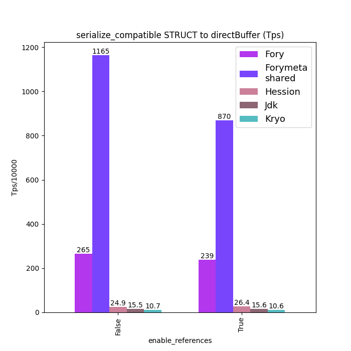
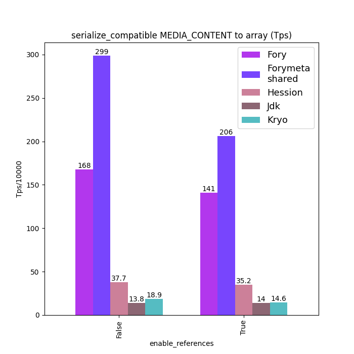
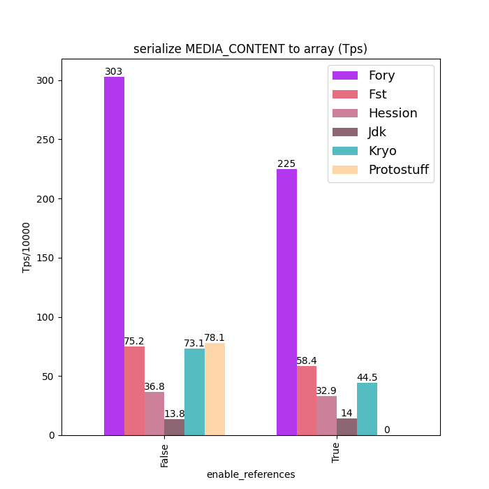
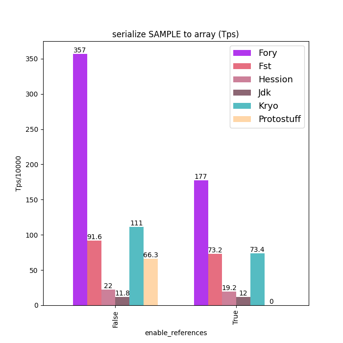
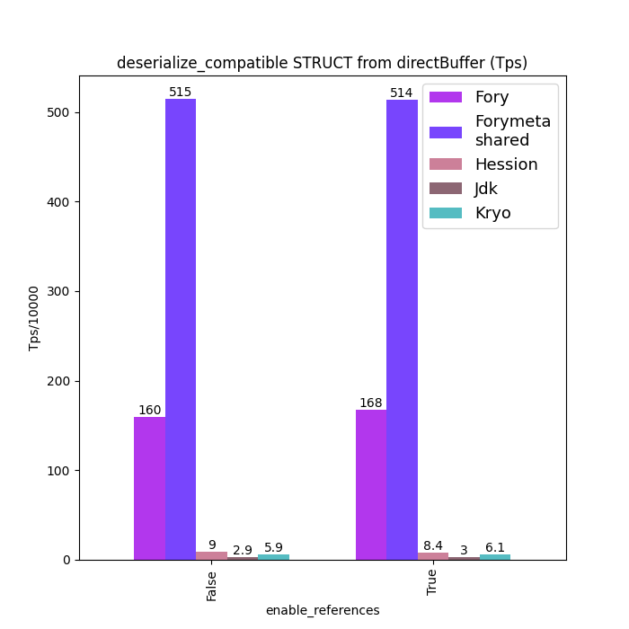
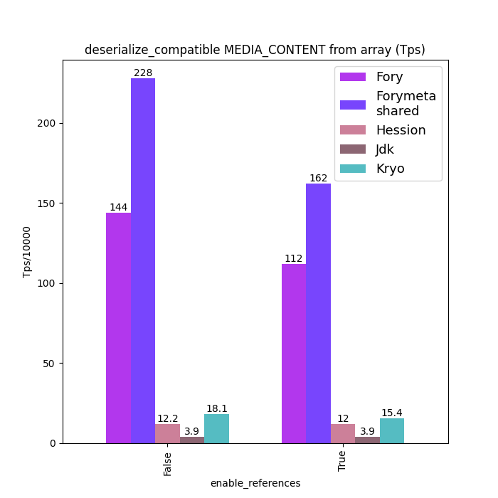
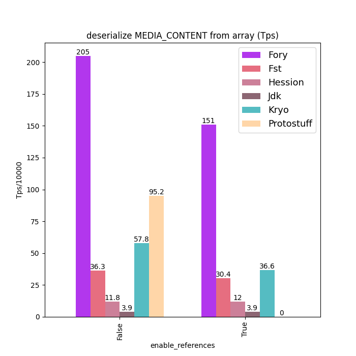
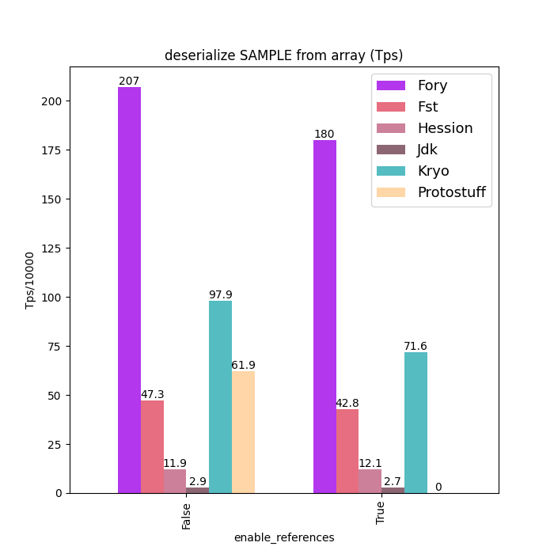
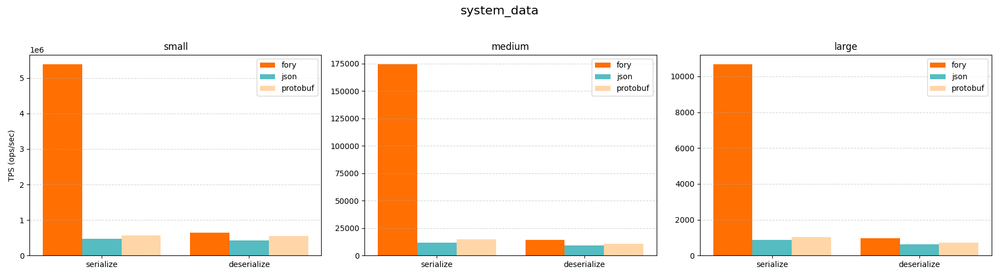

<div align="center">
  <br>
</div>

[](https://github.com/apache/fory/actions/workflows/ci.yml)
[](https://join.slack.com/t/fory-project/shared_invite/zt-36g0qouzm-kcQSvV_dtfbtBKHRwT5gsw)
[](https://x.com/ApacheFory)
[](https://search.maven.org/#search|gav|1|g:"org.apache.fory"%20AND%20a:"fory-core")
[](https://crates.io/crates/fory)
[](https://pypi.org/project/pyfory/)

**Apache Fory™** is a high-performance, multi-language serialization platform built on **just-in-time code generation**, **zero-copy buffers**, and **meta-aware protocols**. It delivers up to **170x** speed-ups over traditional serializers while keeping APIs familiar across Java, Python, Rust, Go, C++, JavaScript, Scala, and Kotlin.

<https://fory.apache.org>

> [!IMPORTANT]
> Apache Fory™ was previously called Apache Fury. For versions prior to 0.11 continue using the `fury` package coordinates as described in the [0.10 documentation](https://fory.apache.org/docs/0.10/docs/introduction/).

## Contents

- [Highlights](#highlights)
- [Architecture](#architecture)
- [Binary Protocols](#binary-protocols)
- [Language Implementations](#language-implementations)
- [Installation](#installation)
- [Quickstart Recipes](#quickstart-recipes)
- [Performance Benchmarks](#performance-benchmarks)
- [Documentation](#documentation)
- [Compatibility](#compatibility)
- [Security](#security)
- [Build From Source](#build-from-source)
- [Contributing](#contributing)
- [License](#license)

## Highlights

- **Performance first**: Aggressive JIT specialization, vectorized hot paths, and buffer pooling reduce CPU time, branch mis-predictions, and hash lookups while keeping allocations minimal.
- **Zero-copy data movement**: Out-of-band buffer transport, Arrow columnar interop, and row encoders enable analytics-grade data pipelines without cloning large payloads.
- **Schema evolution on your terms**: Toggle between schema-consistent and schema-compatible modes, share metadata across messages, and encode polymorphic graphs without sacrificing safety.
- **Cross-language symmetry**: A single xlang binary format with shared metadata mapping keeps Java, Python, Rust, Go, C++, JavaScript, Scala, Kotlin, and TypeScript aligned.
- **Production-grade ergonomics**: Familiar APIs (pickle-style in Python, JDK-compatible in Java, derive macros in Rust, reflection plus codegen in Go) make adoption gradual and low risk.

## Architecture

Apache Fory centers on two complementary execution paths:

- **Object graph engine**: Dynamically generates encoders/decoders using the runtime type system. Supports shared and circular references, reference tracking policies, and configurable polymorphism. Java, Python, Rust, Go, C++, and JavaScript implementations keep semantics aligned per the [xlang specification](docs/specification/xlang_serialization_spec.md).
- **Row format engine**: Builds column-friendly binary rows with random access, partial materialization, and Arrow interoperability. Row encoders can be generated ahead of time or at runtime for both JVM and Python ecosystems.

Core utilities—including the buffer model, meta compression, type resolvers, and GraalVM-friendly code generators—are shared across language bindings to maximize performance parity.

## Binary Protocols

- **[Xlang serialization](docs/specification/xlang_serialization_spec.md)**: Dynamic, reference-aware, polymorphic binary format used for cross-language exchange. Supports meta sharing, streaming mode, Arrow buffers, and optional ref tracking per field or type.
- **[Java serialization](docs/specification/java_serialization_spec.md)**: A drop-in replacement for `ObjectOutputStream` with the same API surface (`writeObject`, `readObject`, `writeReplace`, `readResolve`, `Externalizable`, etc.) yet often 100x faster and ready for GraalVM.
- **[Row format](docs/specification/row_format_spec.md)**: Cache-friendly, random-access layout designed for zero-copy analytics and columnar conversion. Java and Python implementations expose composable encoders/decoders.

## Language Implementations

| Language              | Highlights                                                         | Documentation                                        |
| --------------------- | ------------------------------------------------------------------ | ---------------------------------------------------- |
| Java                  | Object graph, row format, SIMD extensions, GraalVM codegen         | [Java guide](docs/guide/java_serialization_guide.md) |
| Python                | Cython/JIT hybrid, pickle-compatible native mode, Arrow row format | [Python guide](docs/guide/python_guide.md)           |
| C++                   | Row encoder/decoder, Arrow bridges                                 | Coming soon                                          |
| Go                    | Reflection plus codegen, ref tracking, meta string compression     | [Go README](go/README.md)                            |
| Rust                  | Derive macros, Rc/Arc reference tracking, trait object support     | [Rust guide](docs/guide/rust_guide.md)               |
| JavaScript/TypeScript | Node 20+ fast-calls integration, schema registration DSL           | [JavaScript README](javascript/README.md)            |
| Scala                 | JVM extensions for idiomatic collection support                    | [Scala guide](docs/guide/scala_guide.md)             |
| Kotlin                | Extra serializers for Kotlin types, built on Java core             | [Kotlin README](kotlin/README.md)                    |

## Installation

### Java

```xml
<dependency>
  <groupId>org.apache.fory</groupId>
  <artifactId>fory-core</artifactId>
  <version>0.13.0</version>
</dependency>
<!-- Optional row/Arrow support -->
<!--
<dependency>
  <groupId>org.apache.fory</groupId>
  <artifactId>fory-format</artifactId>
  <version>0.13.0</version>
</dependency>
-->
```

Snapshots are available from `https://repository.apache.org/snapshots/` (version `0.14.0-SNAPSHOT`).

### Scala

```sbt
libraryDependencies += "org.apache.fory" % "fory-scala_2.13" % "0.13.0"
libraryDependencies += "org.apache.fory" % "fory-scala_3" % "0.13.0"
```

### Kotlin

```xml
<dependency>
  <groupId>org.apache.fory</groupId>
  <artifactId>fory-kotlin</artifactId>
  <version>0.13.0</version>
</dependency>
```

### Python

```bash
pip install pyfory
# Optional Arrow row format helpers
pip install "pyfory[format]"
```

### Rust

```toml
[dependencies]
fory = "0.13"
```

### Go

```bash
go get github.com/apache/fory/go/fory
```

Additional build instructions for C++, Dart, JavaScript, and Scala live in their respective `README` files.

## Quickstart Recipes

### JVM Native Object Graph

```java
import org.apache.fory.*;
import org.apache.fory.config.*;

public class Example {
  public static void main(String[] args) {
    Fory fory = Fory.builder()
        .withLanguage(Language.JAVA)
        .requireClassRegistration(true)
        .build();

    fory.register(SomeClass.class);
    byte[] bytes = fory.serialize(new SomeClass());
    SomeClass restored = fory.deserialize(bytes);
    System.out.println(restored);
  }
}
```

### Python Native Mode (pickle compatible)

```python
import pyfory

fory = pyfory.Fory(xlang=False, ref=True, strict=False)

def make_multiplier(k):
    def mul(x):
        return k * x
    return mul

payload = fory.dumps(make_multiplier(10))
assert fory.loads(payload)(3) == 30
```

### Cross-Language Graph (Java ↔ Python ↔ Rust ↔ Go)

```java
Fory fory = Fory.builder()
  .withLanguage(Language.XLANG)
  .withRefTracking(true)
  .build();
fory.register(SomeClass.class, "example.SomeClass");
SomeClass value = new SomeClass();
value.f2 = Map.of("k1", "v1");
value.f1 = value;
byte[] bytes = fory.serialize(value);
```

```python
import pyfory

class SomeClass:
    f1: "SomeClass"
    f2: dict[str, str]
    f3: dict[str, str]

fory = pyfory.Fory(ref_tracking=True)
fory.register_type(SomeClass, typename="example.SomeClass")
obj = fory.deserialize(bytes_from_java)
```

```rust
use fory::{Fory, ForyObject};

#[derive(ForyObject, Debug, PartialEq)]
struct User {
    name: String,
    age: i32,
}

let mut fory = Fory::default();
fory.register::<User>(1)?;
let restored: User = fory.deserialize(&bytes_from_python)?;
```

```go
fory := forygo.NewFory(true)
if err := fory.RegisterNamedType(SomeClass{}, "example.SomeClass"); err != nil {
    panic(err)
}
var value interface{}
if err := fory.Unmarshal(bytesFromRust, &value); err != nil {
    panic(err)
}
```

### Row Format Zero-Copy

```python
from dataclasses import dataclass
from typing import Dict, List
import pyfory
import pyarrow as pa

@dataclass
class Bar:
    f1: str
    f2: List[pa.int64]

@dataclass
class Foo:
    f1: pa.int32
    f2: List[pa.int32]
    f3: Dict[str, pa.int32]
    f4: List[Bar]

encoder = pyfory.encoder(Foo)
foo = Foo(
  f1=10,
  f2=list(range(1000)),
  f3={"k0": 0},
  f4=[Bar(f1="b", f2=list(range(10)))]
)
binary = encoder.to_row(foo).to_bytes()
row = pyfory.RowData(encoder.schema, binary)
print(row.f4[100].f2[5])
```

```java
RowEncoder<Foo> encoder = Encoders.bean(Foo.class);
BinaryRow row = encoder.toRow(foo);
BinaryArray bars = row.getArray(3);
Bar partial = Encoders.bean(Bar.class).fromRow(bars.getStruct(10));
```

## Performance Benchmarks

Warm up the runtime to amortize JIT and cache effects before measuring.

### Java Object Graph

<p align="center">




</p>

<p align="center">




</p>

### Rust Object Graph

<p align="center">

</p>

<p align="center">

</p>

More comparisons and raw data live in [docs/benchmarks](docs/benchmarks) and [rust/benches](rust/benches).

## Documentation

- [Java object graph guide](docs/guide/java_serialization_guide.md)
- [Python serialization guide](docs/guide/python_guide.md)
- [Rust serialization guide](docs/guide/rust_guide.md)
- [Go usage guide](go/README.md)
- [Scala guide](docs/guide/scala_guide.md)
- [Row format guide](docs/guide/row_format_guide.md)
- [GraalVM native image guide](docs/guide/graalvm_guide.md)
- [Cross-language type mapping](docs/guide/xlang_type_mapping.md)

The [xlang specification](docs/specification/xlang_serialization_spec.md) and [Java serialization spec](docs/specification/java_serialization_spec.md) describe wire formats in detail.

## Compatibility

- **Schema compatibility**: Java object graph mode supports forward/backward-compatible schemas; cross-language support adopts the same metadata layout and will expose meta compression once complete ([issue #203](https://github.com/apache/fory/issues/203)).
- **Binary compatibility**: Stable across minor releases; major releases may evolve the protocol. Version your stored data by major release and follow the [upgrade guidance](docs/guide/java_serialization_guide.md#upgrade-fory).

## Security

- Keep class/type registration enabled when deserializing untrusted payloads.
- Configure custom resolvers (`ClassResolver#setClassChecker`, Python `DeserializationPolicy`, Rust policy hooks) to gate allowed types.
- Report potential vulnerabilities through the [ASF security process](https://apache.org/security/#reporting-a-vulnerability).

## Build From Source

Language-specific build instructions live in `docs/guide/DEVELOPMENT.md`. Highlights:

- Java: `cd java && mvn -T16 package`
- Python: `cd python && pip install -e .`
- C++: `cd cpp && bazel build //...`
- Rust: `cd rust && cargo test --features tests`
- Go: `cd go/fory && go test ./...`

## Contributing

Review the [CONTRIBUTING](CONTRIBUTING.md) guide, open an issue discussing your proposal, and submit a PR from your fork. Automated CI runs formatters, linters, and language-specific test suites.

## License

Apache Fory™ is licensed under the [Apache License 2.0](LICENSE).
