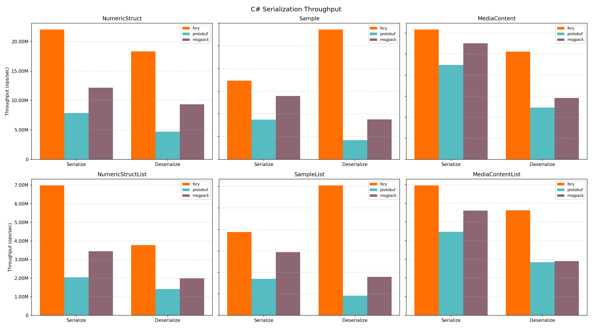
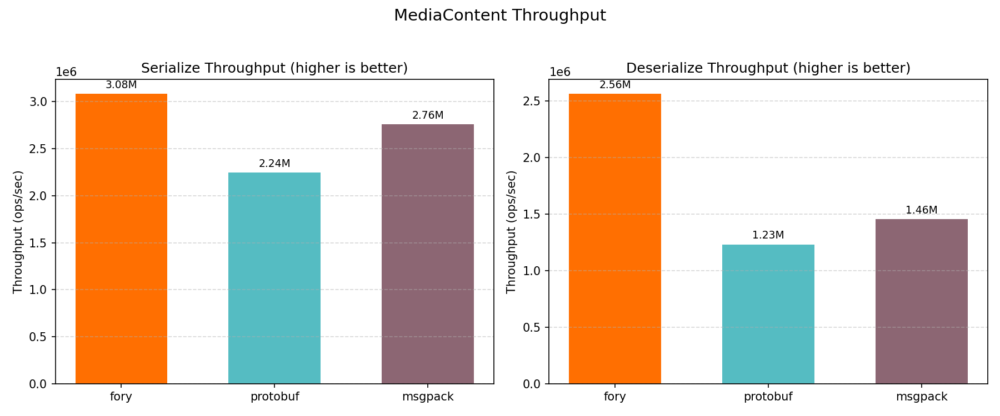
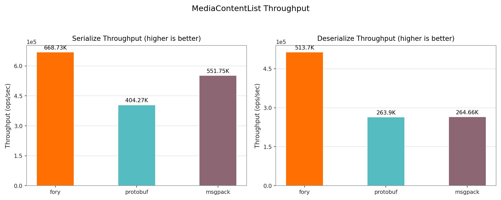
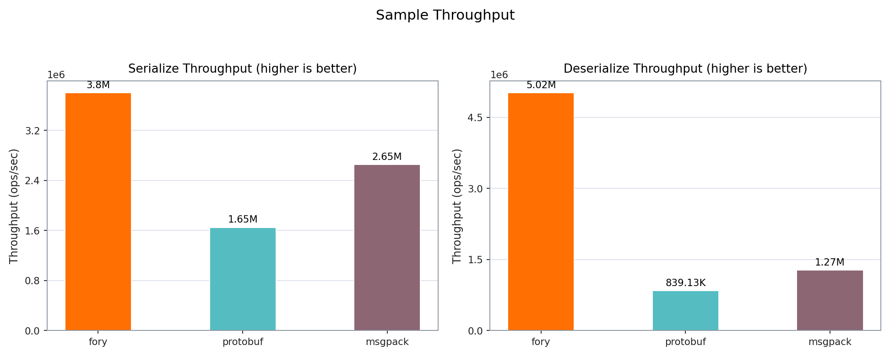
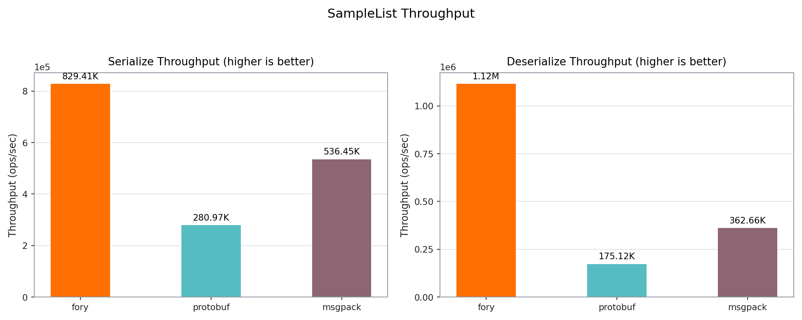
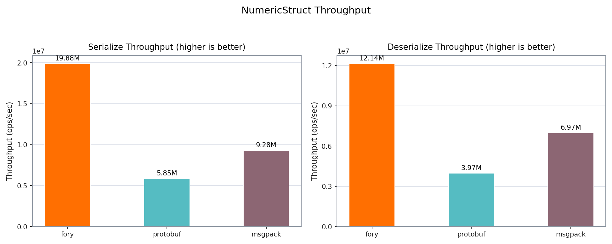
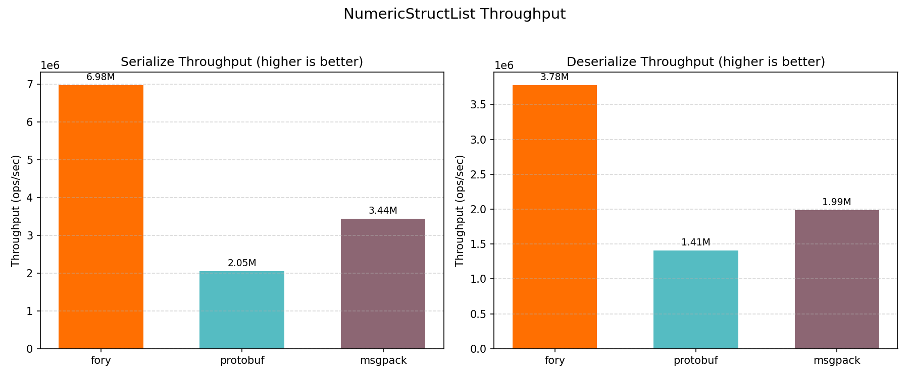

# C# Benchmark Performance Report

_Generated on 2026-03-11 02:14:01_

## How to Generate This Report

```bash
cd benchmarks/csharp
dotnet run -c Release --project ./Fory.CSharpBenchmark.csproj -- --output build/benchmark_results.json
python3 benchmark_report.py --json-file build/benchmark_results.json --output-dir report
```

## Hardware & OS Info

| Key                                | Value                                                                                                                        |
| ---------------------------------- | ---------------------------------------------------------------------------------------------------------------------------- |
| OS                                 | Darwin 24.6.0 Darwin Kernel Version 24.6.0: Wed Oct 15 21:12:15 PDT 2025; root:xnu-11417.140.69.703.14~1/RELEASE_ARM64_T6041 |
| OS Architecture                    | Arm64                                                                                                                        |
| Machine                            | Arm64                                                                                                                        |
| Runtime Version                    | 8.0.24                                                                                                                       |
| Benchmark Date (UTC)               | 2026-03-10T18:14:00.0852460Z                                                                                                 |
| Warmup Seconds                     | 1                                                                                                                            |
| Duration Seconds                   | 3                                                                                                                            |
| CPU Logical Cores (from benchmark) | 12                                                                                                                           |
| CPU Cores (Physical)               | 12                                                                                                                           |
| CPU Cores (Logical)                | 12                                                                                                                           |
| Total RAM (GB)                     | 48.0                                                                                                                         |

## Benchmark Coverage

| Key                 | Value                                                                  |
| ------------------- | ---------------------------------------------------------------------- |
| Cases in input JSON | 36 / 36                                                                |
| Serializers         | fory, msgpack, protobuf                                                |
| Datatypes           | struct, sample, mediacontent, structlist, samplelist, mediacontentlist |
| Operations          | serialize, deserialize                                                 |

## Benchmark Plots

All class-level plots below show throughput (ops/sec).

### Throughput



### Mediacontent



### Mediacontentlist



### Sample



### Samplelist



### Struct



### Structlist



## Benchmark Results

### Timing Results (nanoseconds)

| Datatype         | Operation   | fory (ns) | protobuf (ns) | msgpack (ns) | Fastest |
| ---------------- | ----------- | --------- | ------------- | ------------ | ------- |
| Struct           | Serialize   | 39.2      | 121.5         | 66.0         | fory    |
| Struct           | Deserialize | 58.3      | 180.1         | 102.6        | fory    |
| Sample           | Serialize   | 269.2     | 562.6         | 339.6        | fory    |
| Sample           | Deserialize | 175.6     | 1084.9        | 531.8        | fory    |
| MediaContent     | Serialize   | 306.3     | 434.7         | 351.5        | fory    |
| MediaContent     | Deserialize | 379.4     | 718.8         | 676.9        | fory    |
| StructList       | Serialize   | 136.1     | 468.5         | 266.9        | fory    |
| StructList       | Deserialize | 221.1     | 687.0         | 488.5        | fory    |
| SampleList       | Serialize   | 1198.9    | 2811.9        | 1635.7       | fory    |
| SampleList       | Deserialize | 791.5     | 5174.5        | 2629.2       | fory    |
| MediaContentList | Serialize   | 1393.9    | 2199.4        | 1710.9       | fory    |
| MediaContentList | Deserialize | 1719.5    | 3373.1        | 3401.2       | fory    |

### Throughput Results (ops/sec)

| Datatype         | Operation   | fory TPS   | protobuf TPS | msgpack TPS | Fastest |
| ---------------- | ----------- | ---------- | ------------ | ----------- | ------- |
| Struct           | Serialize   | 25,535,535 | 8,233,006    | 15,153,903  | fory    |
| Struct           | Deserialize | 17,164,793 | 5,553,220    | 9,745,096   | fory    |
| Sample           | Serialize   | 3,715,302  | 1,777,405    | 2,944,981   | fory    |
| Sample           | Deserialize | 5,696,108  | 921,760      | 1,880,420   | fory    |
| MediaContent     | Serialize   | 3,264,890  | 2,300,297    | 2,845,038   | fory    |
| MediaContent     | Deserialize | 2,635,449  | 1,391,138    | 1,477,346   | fory    |
| StructList       | Serialize   | 7,347,503  | 2,134,576    | 3,746,866   | fory    |
| StructList       | Deserialize | 4,522,114  | 1,455,557    | 2,046,988   | fory    |
| SampleList       | Serialize   | 834,086    | 355,633      | 611,365     | fory    |
| SampleList       | Deserialize | 1,263,450  | 193,254      | 380,338     | fory    |
| MediaContentList | Serialize   | 717,408    | 454,670      | 584,497     | fory    |
| MediaContentList | Deserialize | 581,554    | 296,459      | 294,015     | fory    |

### Serialized Data Sizes (bytes)

| Datatype         | fory | protobuf | msgpack |
| ---------------- | ---- | -------- | ------- |
| Struct           | 58   | 61       | 55      |
| Sample           | 446  | 460      | 562     |
| MediaContent     | 365  | 307      | 479     |
| StructList       | 184  | 315      | 284     |
| SampleList       | 1980 | 2315     | 2819    |
| MediaContentList | 1535 | 1550     | 2404    |
