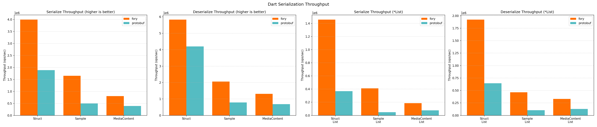
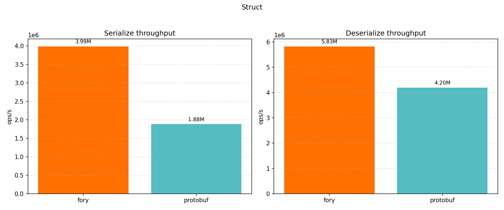
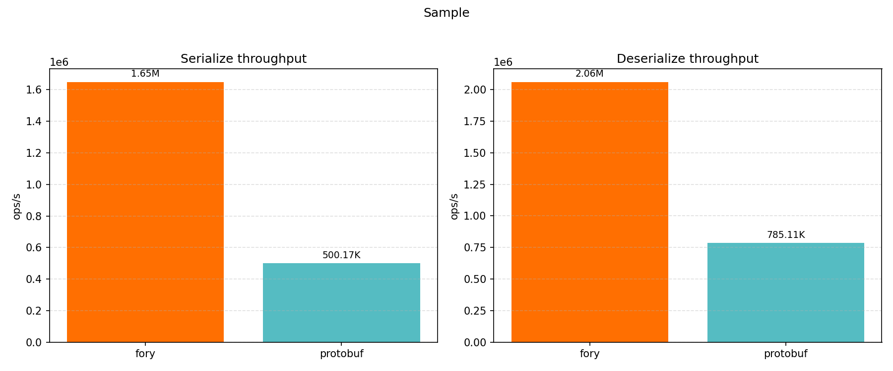
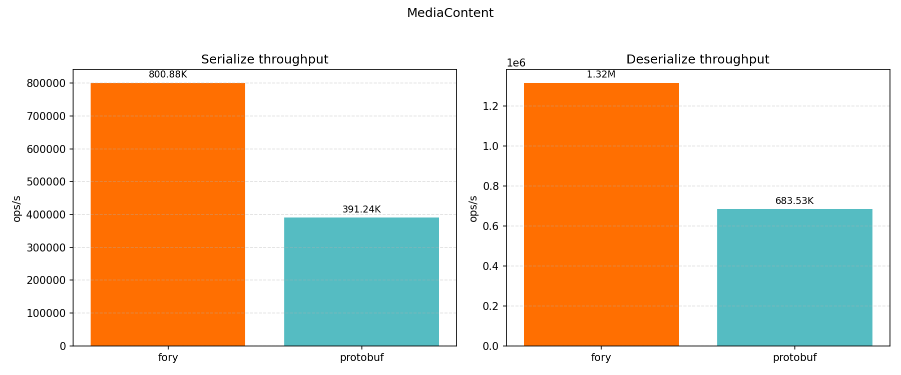
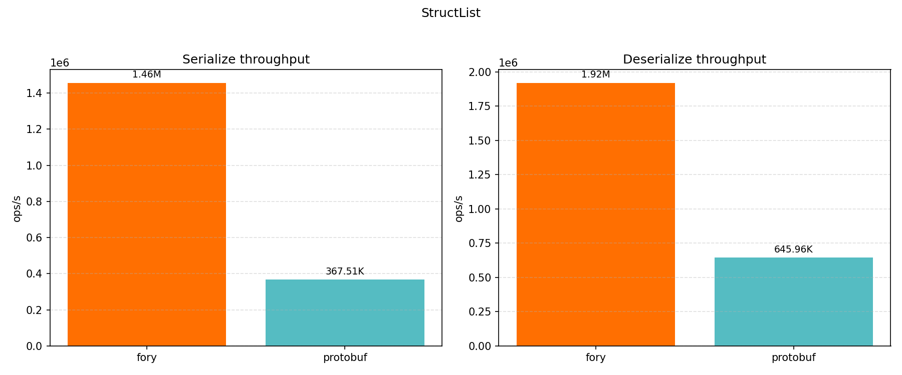
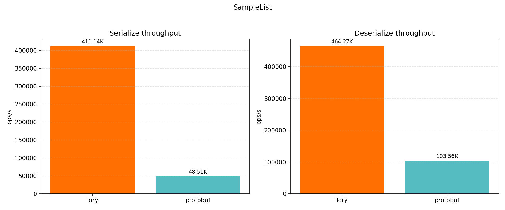
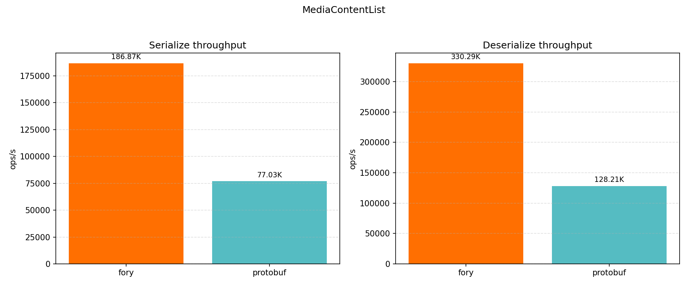

# Fory Dart Benchmark

This benchmark compares serialization and deserialization throughput for Apache Fory and Protocol Buffers in Dart.

## Hardware and Runtime Info

| Key                   | Value                                                            |
| --------------------- | ---------------------------------------------------------------- |
| Timestamp             | 2026-04-13T21:55:28.456625Z                                      |
| OS                    | Version 26.2 (Build 25C56)                                       |
| Host                  | Macbook-Air.local                                                |
| CPU Cores (Logical)   | 8                                                                |
| Memory (GB)           | 8.00                                                             |
| Dart                  | 3.10.4 (stable) (Tue Dec 9 00:01:55 2025 -0800) on "macos_arm64" |
| Samples per case      | 5                                                                |
| Warmup per case (s)   | 1.0                                                              |
| Duration per case (s) | 1.5                                                              |

## Throughput Results

| Datatype         | Operation   |  Fory TPS | Protobuf TPS | Fastest      |
| ---------------- | ----------- | --------: | -----------: | ------------ |
| Struct           | Serialize   | 3,989,432 |    1,884,653 | fory (2.12x) |
| Struct           | Deserialize | 5,828,197 |    4,199,680 | fory (1.39x) |
| Sample           | Serialize   | 1,649,722 |      500,167 | fory (3.30x) |
| Sample           | Deserialize | 2,060,113 |      785,109 | fory (2.62x) |
| MediaContent     | Serialize   |   800,876 |      391,235 | fory (2.05x) |
| MediaContent     | Deserialize | 1,315,115 |      683,533 | fory (1.92x) |
| StructList       | Serialize   | 1,456,396 |      367,506 | fory (3.96x) |
| StructList       | Deserialize | 1,921,006 |      645,958 | fory (2.97x) |
| SampleList       | Serialize   |   411,144 |       48,508 | fory (8.48x) |
| SampleList       | Deserialize |   464,273 |      103,558 | fory (4.48x) |
| MediaContentList | Serialize   |   186,870 |       77,029 | fory (2.43x) |
| MediaContentList | Deserialize |   330,293 |      128,215 | fory (2.58x) |

## Serialized Size (bytes)

| Datatype         | Fory | Protobuf |
| ---------------- | ---: | -------: |
| Struct           |   58 |       61 |
| Sample           |  446 |      377 |
| MediaContent     |  365 |      307 |
| StructList       |  184 |      315 |
| SampleList       | 1980 |     1900 |
| MediaContentList | 1535 |     1550 |

## Per-workload Plots

### Struct

### Sample

### MediaContent

### StructList

### SampleList

### MediaContentList

