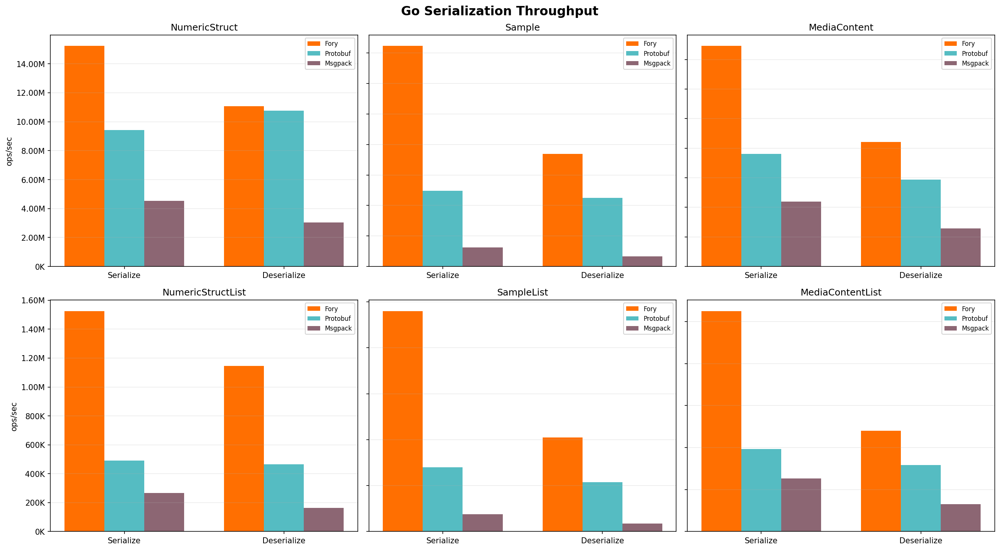
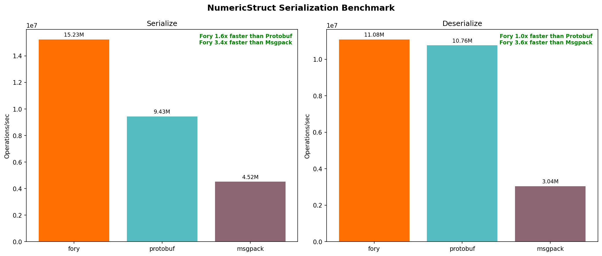
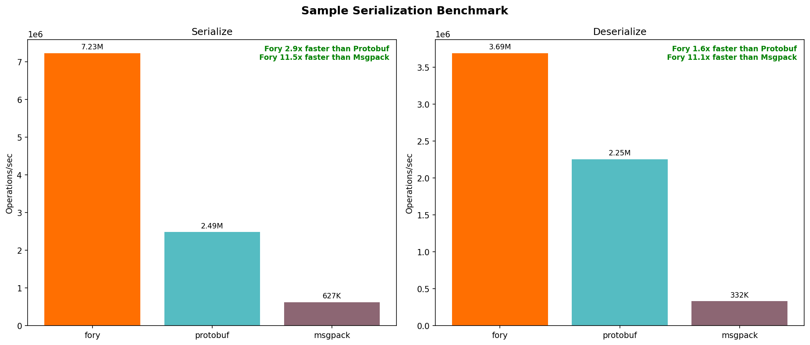
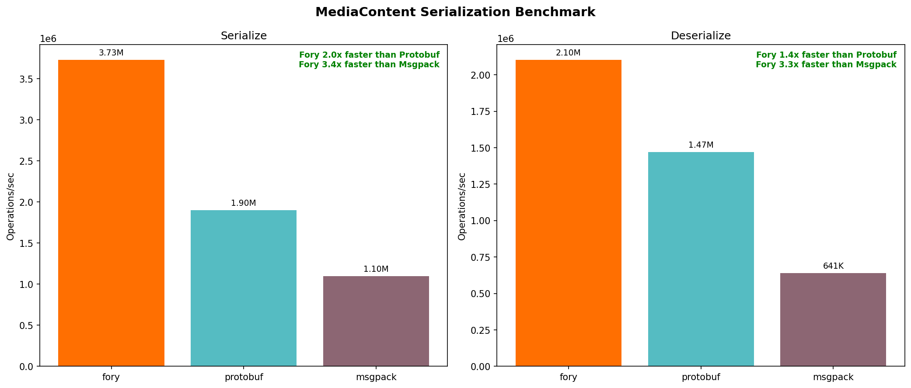
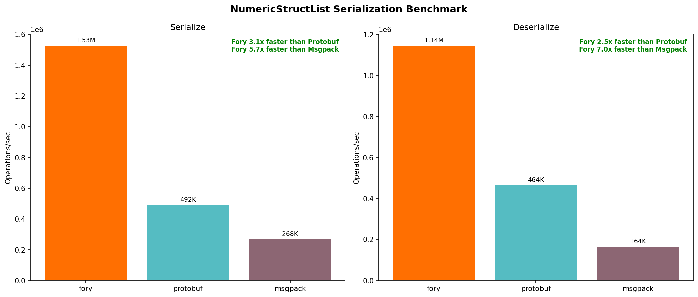
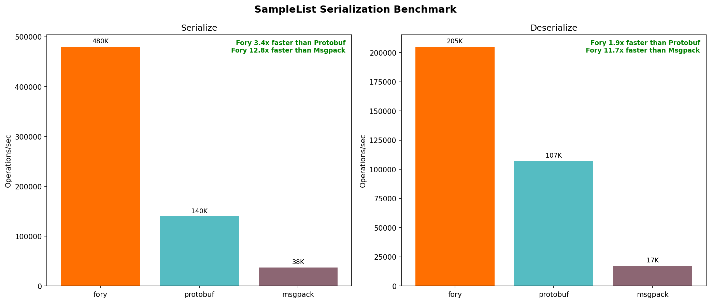
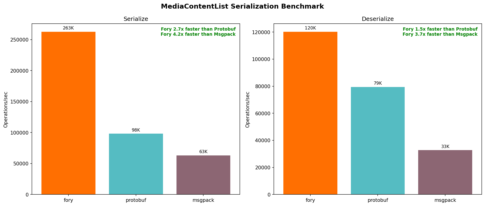

# Go Serialization Benchmark Report

Generated: 2026-05-07 18:51:06

## System Information

- **OS**: Darwin 24.6.0
- **Architecture**: arm64
- **Python**: 3.9.6

## Performance Summary

| Data Type         | Operation   | Fory (ops/s) | Protobuf (ops/s) | Msgpack (ops/s) | Fory vs PB | Fory vs MP |
| ----------------- | ----------- | ------------ | ---------------- | --------------- | ---------- | ---------- |
| NumericStruct     | Serialize   | 15.23M       | 9.43M            | 4.52M           | 1.61x      | 3.37x      |
| NumericStruct     | Deserialize | 11.08M       | 10.76M           | 3.04M           | 1.03x      | 3.65x      |
| Sample            | Serialize   | 7.23M        | 2.49M            | 627K            | 2.91x      | 11.53x     |
| Sample            | Deserialize | 3.69M        | 2.25M            | 332K            | 1.64x      | 11.12x     |
| MediaContent      | Serialize   | 3.73M        | 1.90M            | 1.10M           | 1.96x      | 3.39x      |
| MediaContent      | Deserialize | 2.10M        | 1.47M            | 641K            | 1.43x      | 3.28x      |
| NumericStructList | Serialize   | 1.53M        | 492K             | 268K            | 3.10x      | 5.70x      |
| NumericStructList | Deserialize | 1.14M        | 464K             | 164K            | 2.47x      | 6.98x      |
| SampleList        | Serialize   | 480K         | 140K             | 38K             | 3.44x      | 12.79x     |
| SampleList        | Deserialize | 205K         | 107K             | 17K             | 1.91x      | 11.73x     |
| MediaContentList  | Serialize   | 263K         | 98K              | 63K             | 2.68x      | 4.17x      |
| MediaContentList  | Deserialize | 120K         | 79K              | 33K             | 1.51x      | 3.67x      |

## Detailed Timing (ns/op)

| Data Type         | Operation   | Fory   | Protobuf | Msgpack |
| ----------------- | ----------- | ------ | -------- | ------- |
| NumericStruct     | Serialize   | 65.6   | 106.0    | 221.2   |
| NumericStruct     | Deserialize | 90.2   | 92.9     | 329.0   |
| Sample            | Serialize   | 138.3  | 402.2    | 1594.0  |
| Sample            | Deserialize | 271.0  | 443.8    | 3014.0  |
| MediaContent      | Serialize   | 268.1  | 525.4    | 910.0   |
| MediaContent      | Deserialize | 475.6  | 679.9    | 1560.0  |
| NumericStructList | Serialize   | 655.5  | 2034.0   | 3735.0  |
| NumericStructList | Deserialize | 873.4  | 2154.0   | 6092.0  |
| SampleList        | Serialize   | 2083.0 | 7159.0   | 26637.0 |
| SampleList        | Deserialize | 4878.0 | 9330.0   | 57235.0 |
| MediaContentList  | Serialize   | 3808.0 | 10191.0  | 15868.0 |
| MediaContentList  | Deserialize | 8321.0 | 12599.0  | 30554.0 |

### Serialized Data Sizes (bytes)

| Data Type         | Fory | Protobuf | Msgpack |
| ----------------- | ---- | -------- | ------- |
| NumericStruct     | 57   | 61       | 57      |
| Sample            | 445  | 375      | 524     |
| MediaContent      | 340  | 301      | 400     |
| NumericStructList | 559  | 1260     | 1146    |
| SampleList        | 7599 | 7560     | 10486   |
| MediaContentList  | 5774 | 6080     | 8006    |

## Performance Charts

### Throughput

### NumericStruct

### Sample

### MediaContent

### NumericStructList

### SampleList

### MediaContentList

