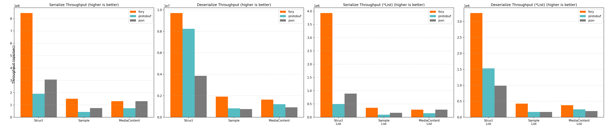
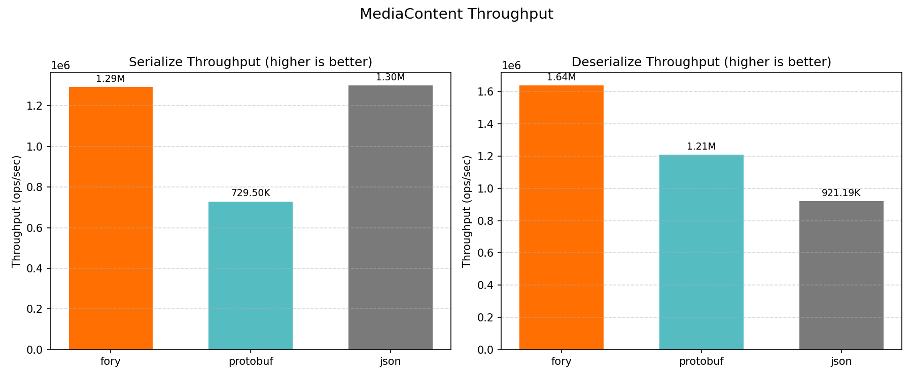
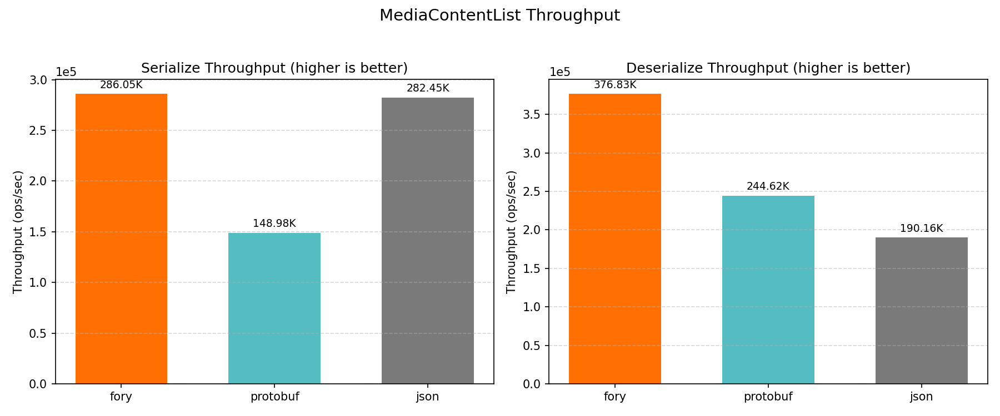
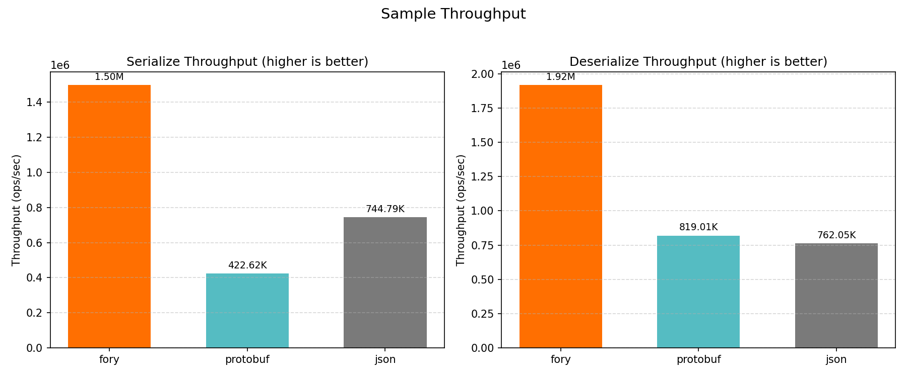
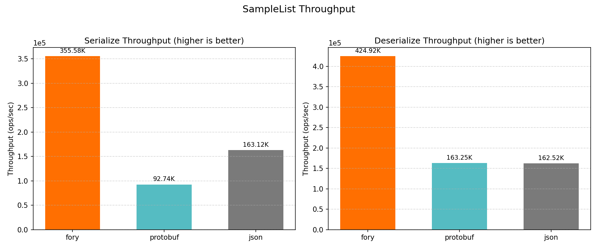
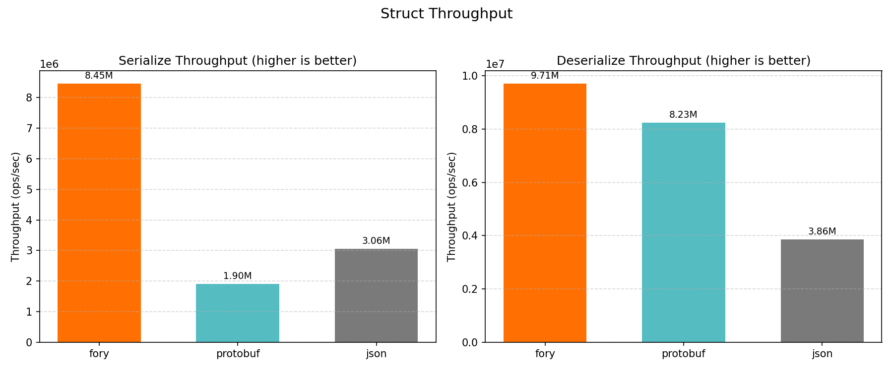
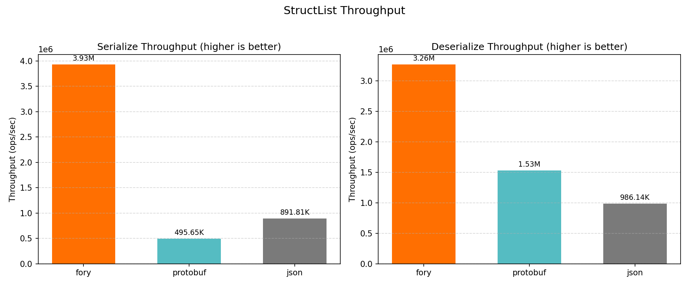

# JavaScript Benchmark Performance Report

_Generated on 2026-04-14 17:11:43_

## How to Generate This Report

```bash
cd benchmarks/javascript
./run.sh
```

## Hardware & OS Info

| Key                        | Value                    |
| -------------------------- | ------------------------ |
| OS                         | Darwin 24.6.0            |
| Machine                    | arm64                    |
| Processor                  | arm                      |
| CPU Cores (Physical)       | 12                       |
| CPU Cores (Logical)        | 12                       |
| Total RAM (GB)             | 48.0                     |
| Benchmark Date             | 2026-04-14T09:09:51.959Z |
| CPU Cores (from benchmark) | 12                       |
| Node.js                    | v22.20.0                 |
| V8                         | 12.4.254.21-node.33      |

## Benchmark Plots

All class-level plots below show throughput (ops/sec).

### Throughput



### MediaContent



### MediaContentList



### Sample



### SampleList



### Struct



### StructList



## Benchmark Results

### Timing Results (nanoseconds)

| Datatype         | Operation   | fory (ns) | protobuf (ns) | json (ns) | Fastest |
| ---------------- | ----------- | --------- | ------------- | --------- | ------- |
| Struct           | Serialize   | 118.3     | 525.3         | 327.0     | fory    |
| Struct           | Deserialize | 103.0     | 121.5         | 259.0     | fory    |
| Sample           | Serialize   | 667.4     | 2366.2        | 1342.7    | fory    |
| Sample           | Deserialize | 521.3     | 1221.0        | 1312.3    | fory    |
| MediaContent     | Serialize   | 773.3     | 1370.8        | 769.3     | json    |
| MediaContent     | Deserialize | 610.5     | 827.0         | 1085.6    | fory    |
| StructList       | Serialize   | 254.6     | 2017.6        | 1121.3    | fory    |
| StructList       | Deserialize | 306.3     | 653.7         | 1014.1    | fory    |
| SampleList       | Serialize   | 2812.3    | 10782.7       | 6130.4    | fory    |
| SampleList       | Deserialize | 2353.4    | 6125.5        | 6153.1    | fory    |
| MediaContentList | Serialize   | 3495.9    | 6712.4        | 3540.5    | fory    |
| MediaContentList | Deserialize | 2653.7    | 4087.9        | 5258.9    | fory    |

### Throughput Results (ops/sec)

| Datatype         | Operation   | fory TPS  | protobuf TPS | json TPS  | Fastest |
| ---------------- | ----------- | --------- | ------------ | --------- | ------- |
| Struct           | Serialize   | 8,453,950 | 1,903,706    | 3,058,232 | fory    |
| Struct           | Deserialize | 9,705,287 | 8,233,664    | 3,860,538 | fory    |
| Sample           | Serialize   | 1,498,391 | 422,620      | 744,790   | fory    |
| Sample           | Deserialize | 1,918,162 | 819,010      | 762,048   | fory    |
| MediaContent     | Serialize   | 1,293,157 | 729,497      | 1,299,908 | json    |
| MediaContent     | Deserialize | 1,638,086 | 1,209,140    | 921,191   | fory    |
| StructList       | Serialize   | 3,928,325 | 495,648      | 891,810   | fory    |
| StructList       | Deserialize | 3,264,827 | 1,529,744    | 986,144   | fory    |
| SampleList       | Serialize   | 355,581   | 92,741       | 163,120   | fory    |
| SampleList       | Deserialize | 424,916   | 163,253      | 162,520   | fory    |
| MediaContentList | Serialize   | 286,053   | 148,977      | 282,445   | fory    |
| MediaContentList | Deserialize | 376,826   | 244,622      | 190,155   | fory    |

### Serialized Data Sizes (bytes)

| Datatype         | fory | protobuf | json |
| ---------------- | ---- | -------- | ---- |
| Struct           | 58   | 61       | 103  |
| Sample           | 446  | 377      | 724  |
| MediaContent     | 391  | 307      | 596  |
| StructList       | 184  | 315      | 537  |
| SampleList       | 1980 | 1900     | 3642 |
| MediaContentList | 1665 | 1550     | 3009 |
