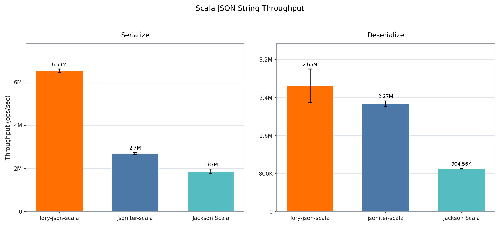
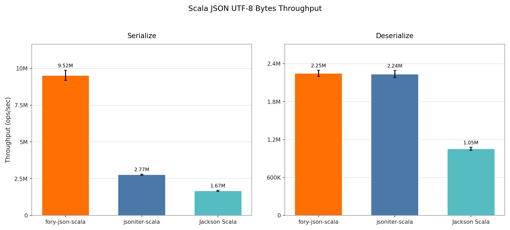

# Scala JSON Benchmark Report

The benchmark compares fory-json-scala, jsoniter-scala, and Jackson Scala on the same immutable Scala MediaContent model and Eishay JSON document. The String group excludes UTF-8 conversion; every library in the UTF-8 group uses its direct byte-array API.

- Benchmark date: `2026-08-14`
- Source commit: `cbecf1782c06ffeb28b4a08c1b409e259ff4148f`
- Platform: macOS-15.7.2-arm64-arm-64bit
- JDK: `26.0.1`
- VM: `OpenJDK 64-Bit Server VM`
- JMH: `1.37`
- Warmup: 1 iterations × `500 ms`
- Measurement: 2 iterations × `500 ms`
- Forks: 1; threads: 1
- Aggregation: median of 3 alternating short runs; error bars show the maximum cross-run deviation
- Mode: throughput; higher is better

## String

## UTF-8 Bytes

## Results

| Representation | Operation   | fory-json-scala ops/sec | jsoniter-scala ops/sec | Jackson Scala ops/sec | Fastest         |
| -------------- | ----------- | ----------------------: | ---------------------: | --------------------: | --------------- |
| String         | Serialize   |               6,527,339 |              2,701,302 |             1,865,102 | fory-json-scala |
| String         | Deserialize |               2,647,817 |              2,269,640 |               904,560 | fory-json-scala |
| UTF-8 bytes    | Serialize   |               9,521,301 |              2,765,106 |             1,674,174 | fory-json-scala |
| UTF-8 bytes    | Deserialize |               2,247,226 |              2,237,662 |             1,053,937 | fory-json-scala |

## Fory performance advantage

| Representation | Operation   | vs jsoniter-scala | vs Jackson Scala |
| -------------- | ----------- | ----------------: | ---------------: |
| String         | Serialize   |            141.6% |           250.0% |
| String         | Deserialize |             16.7% |           192.7% |
| UTF-8 bytes    | Serialize   |            244.3% |           468.7% |
| UTF-8 bytes    | Deserialize |              0.4% |           113.2% |
