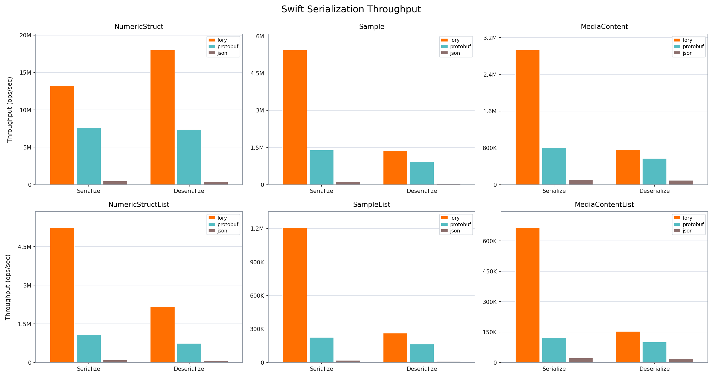

# Fory Swift Benchmark

This benchmark compares serialization and deserialization throughput for Apache Fory, Protocol Buffers, and JSON in Swift.

## Benchmark Products

The ordinary/xlang cases are built by `swift-benchmark`. External-type and carrier comparisons are built by the separate `swift-external-benchmark` product, so building the ordinary product does not compile those models or serializer specializations.

## Throughput Plot

## Hardware and Runtime Info

| Key                   | Value                         |
| --------------------- | ----------------------------- |
| Timestamp             | 2026-08-04T08:09:23Z          |
| OS                    | Version 15.7.2 (Build 24G325) |
| Host                  | MacBook-Pro.local             |
| CPU Cores (Logical)   | 12                            |
| Memory (GB)           | 48.00                         |
| Duration per case (s) | 3                             |

## Throughput Results

| Datatype          | Operation   |   Fory TPS | Protobuf TPS | JSON TPS | Fastest      |
| ----------------- | ----------- | ---------: | -----------: | -------: | ------------ |
| NumericStruct     | Serialize   | 13,259,034 |    7,628,326 |  477,551 | fory (1.74x) |
| NumericStruct     | Deserialize | 18,004,804 |    7,382,178 |  380,570 | fory (2.44x) |
| Sample            | Serialize   |  5,435,141 |    1,397,661 |  101,615 | fory (3.89x) |
| Sample            | Deserialize |  1,380,007 |      927,941 |   51,176 | fory (1.49x) |
| MediaContent      | Serialize   |  2,930,357 |      810,299 |  111,126 | fory (3.62x) |
| MediaContent      | Deserialize |    767,247 |      570,108 |   97,473 | fory (1.35x) |
| NumericStructList | Serialize   |  5,227,289 |    1,087,015 |   93,038 | fory (4.81x) |
| NumericStructList | Deserialize |  2,167,279 |      744,123 |   77,984 | fory (2.91x) |
| SampleList        | Serialize   |  1,205,921 |      224,006 |   20,456 | fory (5.38x) |
| SampleList        | Deserialize |    262,119 |      164,246 |   11,008 | fory (1.60x) |
| MediaContentList  | Serialize   |    664,458 |      121,100 |   22,427 | fory (5.49x) |
| MediaContentList  | Deserialize |    153,412 |      100,741 |   19,868 | fory (1.52x) |

## Serialized Size (bytes)

| Datatype          | Fory | Protobuf | JSON |
| ----------------- | ---: | -------: | ---: |
| NumericStruct     |   78 |       93 |  159 |
| Sample            |  445 |      375 |  696 |
| MediaContent      |  362 |      301 |  608 |
| NumericStructList |  255 |      475 |  816 |
| SampleList        | 1978 |     1890 | 3501 |
| MediaContentList  | 1531 |     1520 | 3067 |
