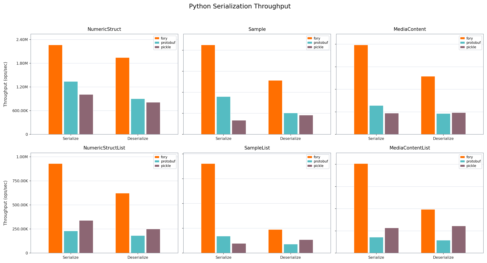
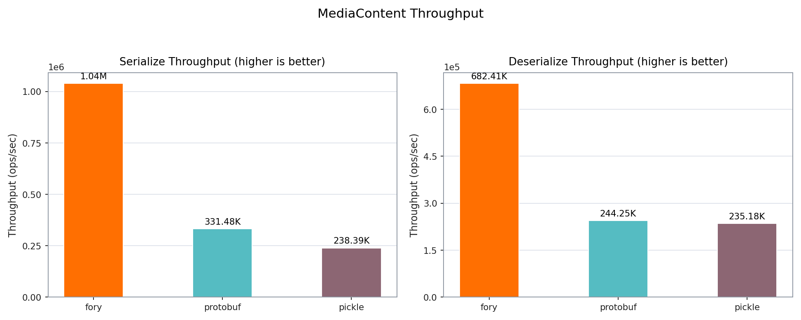
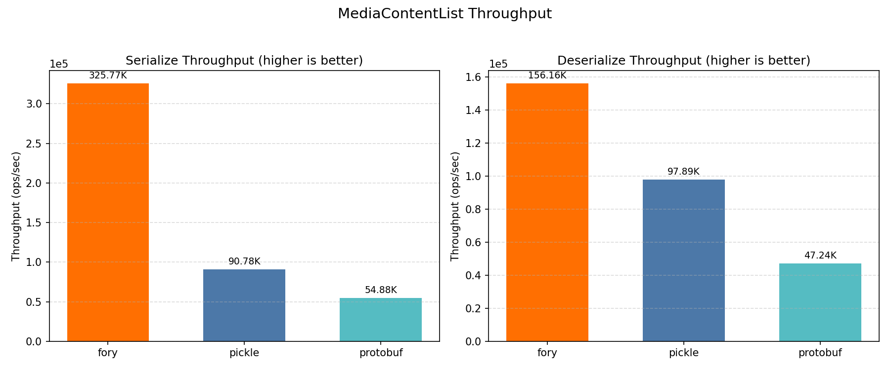
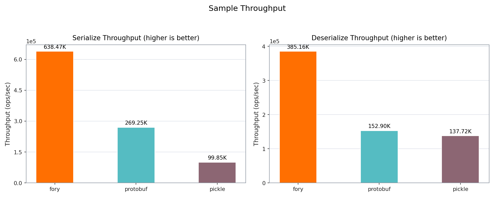
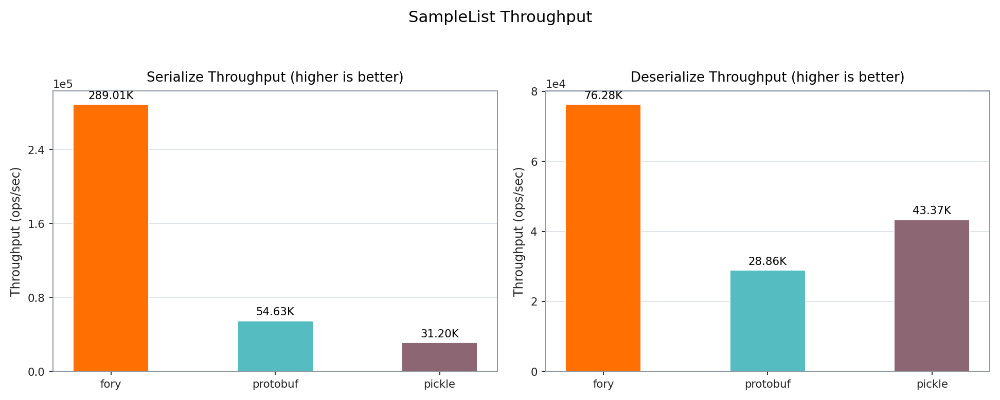
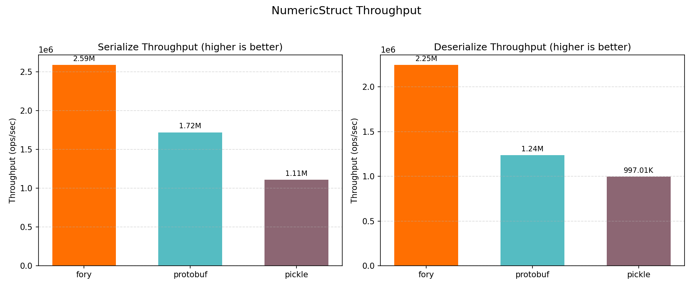
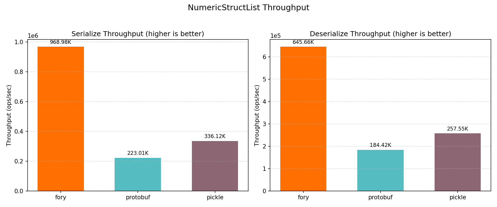

# Python Benchmark Performance Report

_Generated on 2026-03-03 13:42:38_

## How to Generate This Report

```bash
cd benchmarks/python
./run.sh
```

## Hardware & OS Info

| Key                   | Value                        |
| --------------------- | ---------------------------- |
| OS                    | Darwin 24.6.0                |
| Machine               | arm64                        |
| Processor             | arm                          |
| Python                | 3.10.8                       |
| CPU Cores (Physical)  | 12                           |
| CPU Cores (Logical)   | 12                           |
| Total RAM (GB)        | 48.0                         |
| Python Implementation | CPython                      |
| Benchmark Platform    | macOS-15.7.2-arm64-arm-64bit |

## Benchmark Configuration

| Key        | Value |
| ---------- | ----- |
| warmup     | 3     |
| iterations | 15    |
| repeat     | 5     |
| number     | 1000  |
| list_size  | 5     |

## Benchmark Plots

All plots show throughput (ops/sec); higher is better.

### Throughput

<p align="center">

</p>

### Mediacontent

<p align="center">

</p>

### Mediacontentlist

<p align="center">

</p>

### Sample

<p align="center">

</p>

### Samplelist

<p align="center">

</p>

### Struct

<p align="center">

</p>

### Structlist

<p align="center">

</p>

## Benchmark Results

### Timing Results (nanoseconds)

| Datatype         | Operation   | fory (ns) | pickle (ns) | protobuf (ns) | Fastest |
| ---------------- | ----------- | --------- | ----------- | ------------- | ------- |
| Struct           | Serialize   | 417.9     | 868.9       | 548.9         | fory    |
| Struct           | Deserialize | 516.1     | 910.6       | 742.4         | fory    |
| Sample           | Serialize   | 828.1     | 1663.5      | 2383.7        | fory    |
| Sample           | Deserialize | 1282.4    | 2296.3      | 3992.7        | fory    |
| MediaContent     | Serialize   | 1139.9    | 2859.7      | 2867.1        | fory    |
| MediaContent     | Deserialize | 1719.5    | 2854.3      | 3236.1        | fory    |
| StructList       | Serialize   | 1009.1    | 2630.6      | 3281.6        | fory    |
| StructList       | Deserialize | 1387.2    | 2651.9      | 3547.9        | fory    |
| SampleList       | Serialize   | 2828.3    | 5541.0      | 15256.6       | fory    |
| SampleList       | Deserialize | 5043.4    | 8144.7      | 18912.5       | fory    |
| MediaContentList | Serialize   | 3417.9    | 9341.9      | 15853.2       | fory    |
| MediaContentList | Deserialize | 6138.7    | 8435.3      | 16442.6       | fory    |

### Throughput Results (ops/sec)

| Datatype         | Operation   | fory TPS  | pickle TPS | protobuf TPS | Fastest |
| ---------------- | ----------- | --------- | ---------- | ------------ | ------- |
| Struct           | Serialize   | 2,393,086 | 1,150,946  | 1,821,982    | fory    |
| Struct           | Deserialize | 1,937,707 | 1,098,170  | 1,346,915    | fory    |
| Sample           | Serialize   | 1,207,542 | 601,144    | 419,511      | fory    |
| Sample           | Deserialize | 779,789   | 435,489    | 250,460      | fory    |
| MediaContent     | Serialize   | 877,300   | 349,688    | 348,780      | fory    |
| MediaContent     | Deserialize | 581,563   | 350,354    | 309,018      | fory    |
| StructList       | Serialize   | 991,017   | 380,145    | 304,732      | fory    |
| StructList       | Deserialize | 720,901   | 377,081    | 281,855      | fory    |
| SampleList       | Serialize   | 353,574   | 180,473    | 65,545       | fory    |
| SampleList       | Deserialize | 198,280   | 122,780    | 52,875       | fory    |
| MediaContentList | Serialize   | 292,578   | 107,045    | 63,079       | fory    |
| MediaContentList | Deserialize | 162,902   | 118,550    | 60,818       | fory    |

### Serialized Data Sizes (bytes)

| Datatype         | fory | pickle | protobuf |
| ---------------- | ---- | ------ | -------- |
| Struct           | 72   | 126    | 61       |
| Sample           | 517  | 793    | 375      |
| MediaContent     | 470  | 586    | 301      |
| StructList       | 205  | 420    | 315      |
| SampleList       | 1810 | 2539   | 1890     |
| MediaContentList | 1756 | 1377   | 1520     |
