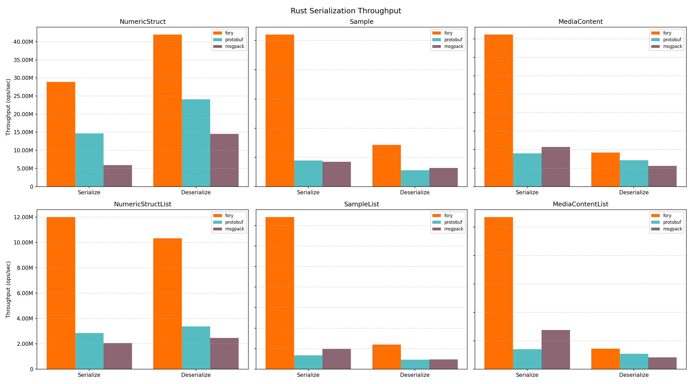
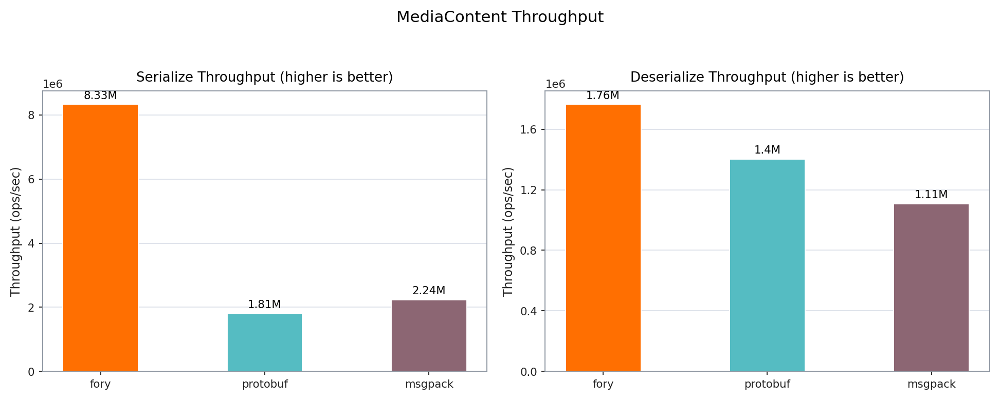
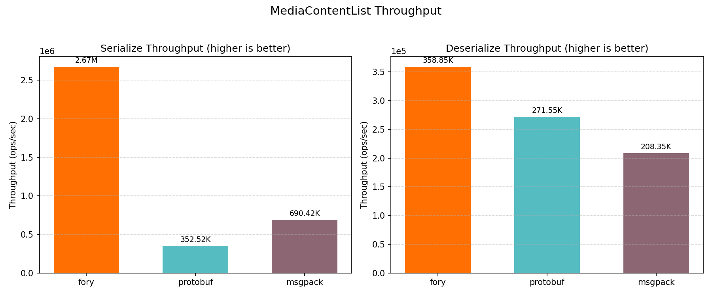
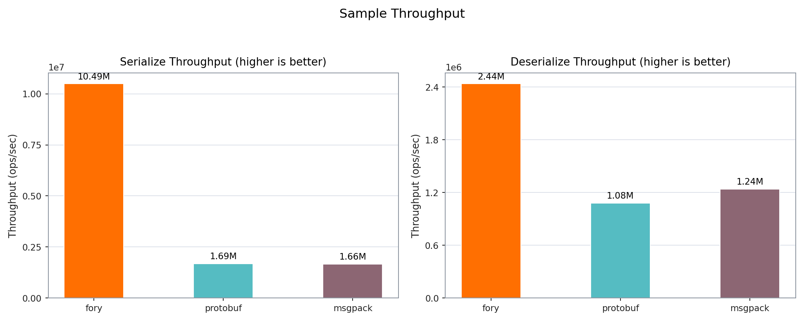
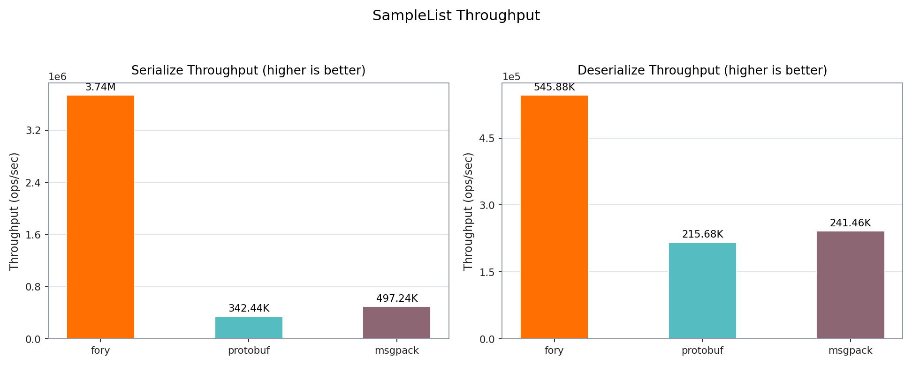
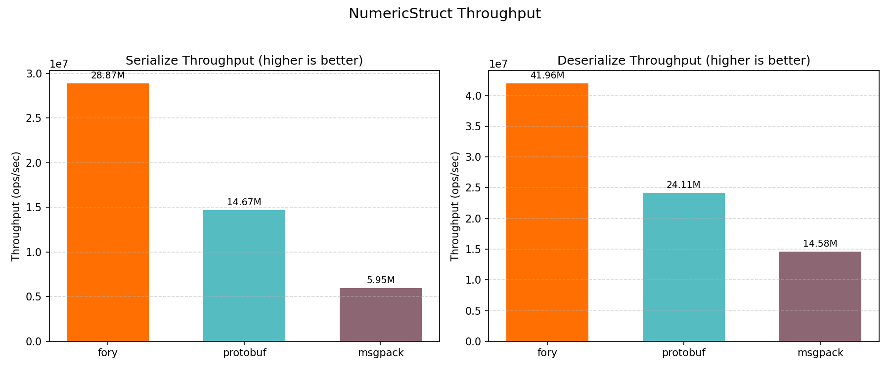
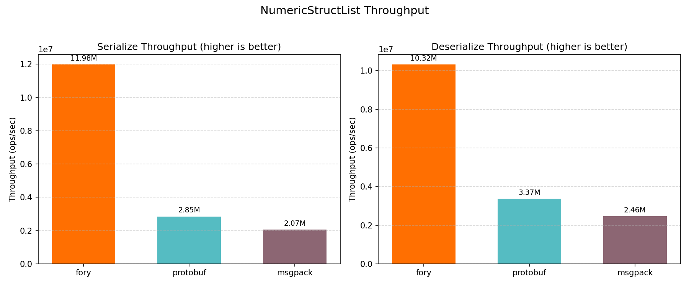

# Rust Benchmark Performance Report

_Generated on 2026-03-20 18:40:46_

## How to Generate This Report

```bash
cd benchmarks/rust
cargo bench --bench serialization_bench 2>&1 | tee results/cargo_bench.log
cargo run --release --bin fory_profiler -- --print-all-serialized-sizes | tee results/serialized_sizes.txt
python benchmark_report.py --log-file results/cargo_bench.log --size-file results/serialized_sizes.txt --output-dir results
```

## Hardware & OS Info

| Key                  | Value               |
| -------------------- | ------------------- |
| OS                   | Darwin 24.6.0       |
| Machine              | arm64               |
| Processor            | arm                 |
| CPU Cores (Physical) | 12                  |
| CPU Cores (Logical)  | 12                  |
| Total RAM (GB)       | 48.0                |
| Benchmark Date       | 2026-03-20T18:40:44 |

## Benchmark Plots

All class-level plots below show throughput (ops/sec).

### Throughput



### MediaContent



### MediaContentList



### Sample



### SampleList



### Struct



### StructList



## Benchmark Results

### Timing Results (nanoseconds)

| Datatype         | Operation   | fory (ns) | protobuf (ns) | Fastest |
| ---------------- | ----------- | --------- | ------------- | ------- |
| Struct           | Serialize   | 69.6      | 76.8          | fory    |
| Struct           | Deserialize | 27.0      | 70.4          | fory    |
| Sample           | Serialize   | 148.5     | 584.3         | fory    |
| Sample           | Deserialize | 350.9     | 983.1         | fory    |
| MediaContent     | Serialize   | 277.8     | 553.2         | fory    |
| MediaContent     | Deserialize | 472.3     | 706.4         | fory    |
| StructList       | Serialize   | 170.4     | 385.4         | fory    |
| StructList       | Deserialize | 96.8      | 294.7         | fory    |
| SampleList       | Serialize   | 356.2     | 3155.7        | fory    |
| SampleList       | Deserialize | 1644.1    | 4361.0        | fory    |
| MediaContentList | Serialize   | 657.4     | 2844.0        | fory    |
| MediaContentList | Deserialize | 2397.7    | 3696.6        | fory    |

### Throughput Results (ops/sec)

| Datatype         | Operation   | fory TPS   | protobuf TPS | Fastest |
| ---------------- | ----------- | ---------- | ------------ | ------- |
| Struct           | Serialize   | 14,366,165 | 13,022,359   | fory    |
| Struct           | Deserialize | 37,065,866 | 14,202,528   | fory    |
| Sample           | Serialize   | 6,734,914  | 1,711,537    | fory    |
| Sample           | Deserialize | 2,849,409  | 1,017,201    | fory    |
| MediaContent     | Serialize   | 3,600,230  | 1,807,664    | fory    |
| MediaContent     | Deserialize | 2,117,433  | 1,415,689    | fory    |
| StructList       | Serialize   | 5,866,823  | 2,595,043    | fory    |
| StructList       | Deserialize | 10,330,152 | 3,393,051    | fory    |
| SampleList       | Serialize   | 2,807,333  | 316,887      | fory    |
| SampleList       | Deserialize | 608,236    | 229,305      | fory    |
| MediaContentList | Serialize   | 1,521,098  | 351,617      | fory    |
| MediaContentList | Deserialize | 417,066    | 270,519      | fory    |

### Serialized Data Sizes (bytes)

| Datatype         | fory | protobuf |
| ---------------- | ---- | -------- |
| Struct           | 58   | 61       |
| Sample           | 446  | 375      |
| MediaContent     | 365  | 301      |
| StructList       | 184  | 315      |
| SampleList       | 1980 | 1890     |
| MediaContentList | 1535 | 1520     |
