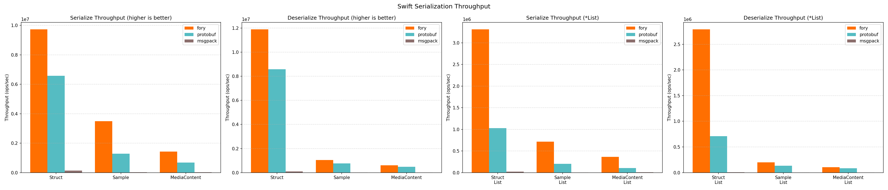

# Fory Swift Benchmark

This benchmark compares serialization and deserialization throughput for Apache Fory, Protocol Buffers, and MessagePack in Swift.

## Hardware and Runtime Info

| Key                   | Value                         |
| --------------------- | ----------------------------- |
| Timestamp             | 2026-03-10T06:25:16Z          |
| OS                    | Version 15.7.2 (Build 24G325) |
| Host                  | macbook-pro.local             |
| CPU Cores (Logical)   | 12                            |
| Memory (GB)           | 48.00                         |
| Duration per case (s) | 3                             |

## Throughput Results

| Datatype         | Operation   |   Fory TPS | Protobuf TPS | Msgpack TPS | Fastest      |
| ---------------- | ----------- | ---------: | -----------: | ----------: | ------------ |
| Struct           | Serialize   |  9,727,950 |    6,572,406 |     141,248 | fory (1.48x) |
| Struct           | Deserialize | 11,889,570 |    8,584,510 |      99,792 | fory (1.39x) |
| Sample           | Serialize   |  3,496,305 |    1,281,983 |      17,188 | fory (2.73x) |
| Sample           | Deserialize |  1,045,018 |      765,706 |      12,767 | fory (1.36x) |
| MediaContent     | Serialize   |  1,425,354 |      678,542 |      29,048 | fory (2.10x) |
| MediaContent     | Deserialize |    614,447 |      478,298 |      12,711 | fory (1.28x) |
| StructList       | Serialize   |  3,307,962 |    1,028,210 |      24,781 | fory (3.22x) |
| StructList       | Deserialize |  2,788,200 |      708,596 |       8,160 | fory (3.93x) |
| SampleList       | Serialize   |    715,734 |      205,380 |       3,361 | fory (3.48x) |
| SampleList       | Deserialize |    199,317 |      133,425 |       1,498 | fory (1.49x) |
| MediaContentList | Serialize   |    364,097 |      103,721 |       5,538 | fory (3.51x) |
| MediaContentList | Deserialize |    103,421 |       86,331 |       1,529 | fory (1.20x) |

## Serialized Size (bytes)

| Datatype         | Fory | Protobuf | Msgpack |
| ---------------- | ---: | -------: | ------: |
| MediaContent     |  365 |      301 |     524 |
| MediaContentList | 1535 |     1520 |    2639 |
| Sample           |  446 |      375 |     737 |
| SampleList       | 1980 |     1890 |    3698 |
| Struct           |   58 |       61 |      65 |
| StructList       |  184 |      315 |     338 |
