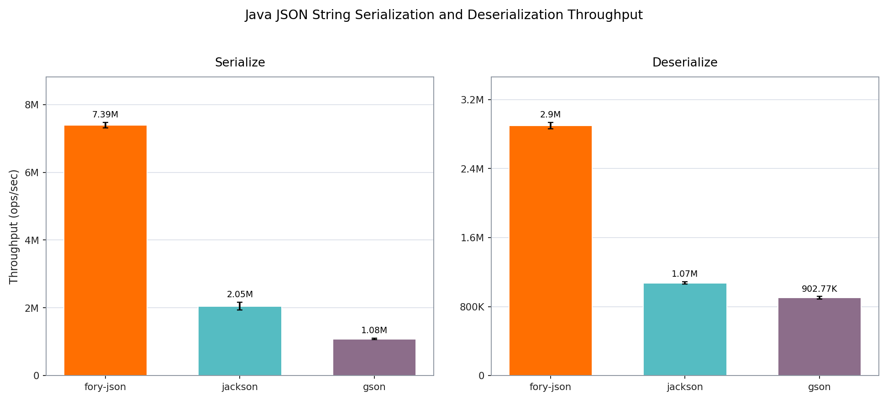

# Fory JSON

Fory JSON is Apache Fory's thread-safe Java JSON codec. It provides interpreted
and runtime-generated codecs for Java objects, records, immutable creator-based
classes, common JDK types, generic containers, custom complete-value codecs, and
finite annotation-declared polymorphism.

Fory JSON is separate from Fory's binary native and xlang protocols. Use it to
exchange ordinary JSON with browsers, APIs, logs, configuration, or another JSON
implementation. Use Fory binary serialization when you need cross-language
schema metadata, reference identity, circular graphs, or binary-only features.

## Performance

The benchmark compares Fory JSON with Jackson and Gson using String and UTF-8
byte APIs. The String group excludes UTF-8 conversion. Gson's byte results
include its required String/UTF-8 conversion. Higher throughput is better.

<p align="center">


</p>

| Representation | Operation   | Fory JSON ops/sec | Jackson ops/sec | Gson ops/sec |
| -------------- | ----------- | ----------------: | --------------: | -----------: |
| String         | Serialize   |         7,387,465 |       2,049,368 |    1,084,042 |
| String         | Deserialize |         2,897,955 |       1,074,885 |      902,772 |
| UTF-8 bytes    | Serialize   |        10,375,498 |       1,868,614 |    1,037,211 |
| UTF-8 bytes    | Deserialize |         3,077,158 |       1,268,397 |      933,079 |

See the [full benchmark report](../../docs/benchmarks/json/java/).

## Requirements and Installation

Fory JSON supports Java 8 and later on standard JDKs, GraalVM Native Image, and
Android. Java Records are supported on Java 17 and later. Use the same version
for every Fory module in one application.

Maven:

```xml
<dependency>
  <groupId>org.apache.fory</groupId>
  <artifactId>fory-json</artifactId>
  <version>1.5.0</version>
</dependency>
```

Gradle:

```kotlin
implementation("org.apache.fory:fory-json:1.5.0")
```

On JDK 25 and later, opening `java.lang.invoke` to Fory core is not required, but is recommended. It avoids
the current-JDK Unsafe fallback and is required when Unsafe access is disabled or unavailable,
including with `--sun-misc-unsafe-memory-access=deny`. Use `ALL-UNNAMED` on the classpath:

```bash
--add-opens=java.base/java.lang.invoke=ALL-UNNAMED
```

Use the Fory core module name on the module path:

```bash
--add-opens=java.base/java.lang.invoke=org.apache.fory.core
```

The Java Platform Module System (JPMS) module name of Fory JSON is
`org.apache.fory.json`.

## Quick Start

Create one `ForyJson` instance and reuse it. The instance is thread-safe and
has no close lifecycle.

```java
import java.nio.charset.StandardCharsets;
import org.apache.fory.json.ForyJson;

public final class JsonExample {
  private static final ForyJson JSON = ForyJson.builder().build();

  public static final class User {
    public long id;
    public String name;

    public User() {}

    User(long id, String name) {
      this.id = id;
      this.name = name;
    }
  }

  public static void main(String[] args) {
    User input = new User(7, "Alice");

    String text = JSON.toJson(input);
    byte[] utf8 = JSON.toJsonBytes(input);

    User fromText = JSON.fromJson(text, User.class);
    User fromUtf8 = JSON.fromJson(utf8, User.class);

    System.out.println(text);
    System.out.println(new String(utf8, StandardCharsets.UTF_8));
    System.out.println(fromText.name + " / " + fromUtf8.name);
  }
}
```

Unknown input properties are skipped unless an Any field or any-setter receives
them. Null object properties are omitted by default. Use `JsonPropertyOrder`
or `JsonProperty.index` when emitted property order must be explicit.

## Core API

Fory JSON supports String and UTF-8 byte input/output. It does not currently
provide an `InputStream` parsing API.

| Operation            | Runtime type              | Declared `Class`                | Declared `TypeRef`                 |
| -------------------- | ------------------------- | ------------------------------- | ---------------------------------- |
| String output        | `toJson(value)`           | `toJson(value, type)`           | `toJson(value, typeRef)`           |
| UTF-8 bytes          | `toJsonBytes(value)`      | `toJsonBytes(value, type)`      | `toJsonBytes(value, typeRef)`      |
| UTF-8 `OutputStream` | `writeJsonTo(value, out)` | `writeJsonTo(value, type, out)` | `writeJsonTo(value, typeRef, out)` |
| String input         | -                         | `fromJson(text, type)`          | `fromJson(text, typeRef)`          |
| UTF-8 input          | -                         | `fromJson(bytes, type)`         | `fromJson(bytes, typeRef)`         |

Every `fromJson` call consumes exactly one JSON value and rejects trailing
non-whitespace content. Returned strings and byte arrays are detached from
internal reusable buffers. `writeJsonTo` writes one complete buffered document;
it does not flush or close the caller-owned stream.

Use `TypeRef` when a root type contains generic arguments:

```java
import java.util.List;
import org.apache.fory.json.ForyJson;
import org.apache.fory.reflect.TypeRef;

ForyJson json = ForyJson.builder().build();
TypeRef<List<User>> usersType = new TypeRef<List<User>>() {};

List<User> users = json.fromJson("[{\"id\":7,\"name\":\"Alice\"}]", usersType);
String encoded = json.toJson(users, usersType);
```

Use declared-type overloads when a base type owns `JsonSubTypes` metadata.
Declared writes require a fully bound type; wildcards and type variables are
rejected.

## Runtime and Object-Mapping Summary

`ForyJson` is immutable and thread-safe after `build()`. Reuse one instance.
Code generation and asynchronous compilation are enabled by default; registered
codecs and type checkers may be called concurrently and must also be thread-safe.

By default, Fory JSON combines eligible fields and public JavaBean accessors into
logical properties. Field mode uses fields without getter/setter discovery.
Records use their canonical constructor; immutable classes can use
`JsonCreator`; ordinary mutable classes normally use a no-argument constructor.
Built-in mappings cover Java scalars, arrays, collections, maps, optionals,
atomic values, time values, common JDK types, `JsonObject`, and `JsonArray`.

The canonical [Object Mapping guide](../../docs/json/object-mapping.md) defines
property discovery, construction, supported types, dynamic JSON trees, map keys,
threading, code generation, and ordinary builder options. Type policy, depth,
graph memory, and external input controls belong to
[Fory JSON Security](../../docs/json/security.md).

## Documentation

The canonical Fory JSON documentation is split by reader task:

- [Overview and format boundary](../../docs/json/index.md)
- [Getting Started](../../docs/json/getting-started.md)
- [Object Mapping](../../docs/json/object-mapping.md)
- [Annotations](../../docs/json/annotations.md)
- [Custom Codecs](../../docs/json/custom-codecs.md)
- [Android](../../docs/json/android.md)
- [GraalVM Native Image](../../docs/json/graalvm.md)
- [Security](../../docs/json/security.md)
- [Troubleshooting](../../docs/json/troubleshooting.md)

Annotations cover names and ordering, inclusion, Mixins, value and raw
representations, Base64, formatting, unwrapped objects, creators, validators,
closed polymorphism, and dynamic members. See the
[Annotations reference](../../docs/json/annotations.md).

`JsonValueCodec`, `MapKeyCodec`, registrations, and `JsonCodec` customize a
complete value or one direct child level. See
[Custom Codecs](../../docs/json/custom-codecs.md).

Android uses interpreted or annotation-processor-generated access with exact R8
rules. See the [Android guide](../../docs/json/android.md).

GraalVM Native Image discovers reachable model, Mixin, provider, creator,
validator, and codec metadata at image build time. See the
[GraalVM Native Image guide](../../docs/json/graalvm.md).

Before decoding untrusted JSON, define an accepted-type policy and configure
depth, graph-memory, and external input limits. See
[Fory JSON Security](../../docs/json/security.md).
